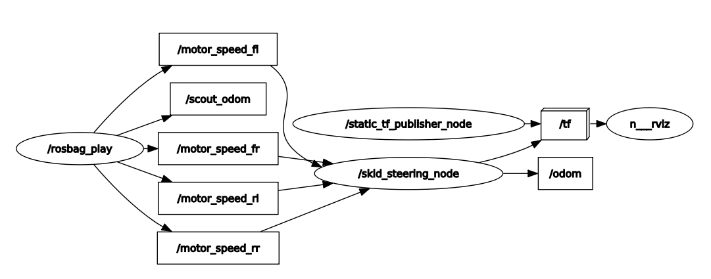
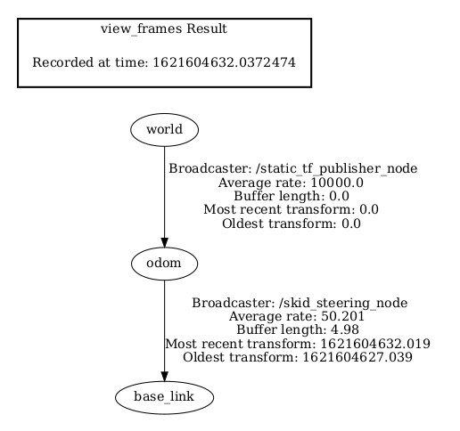
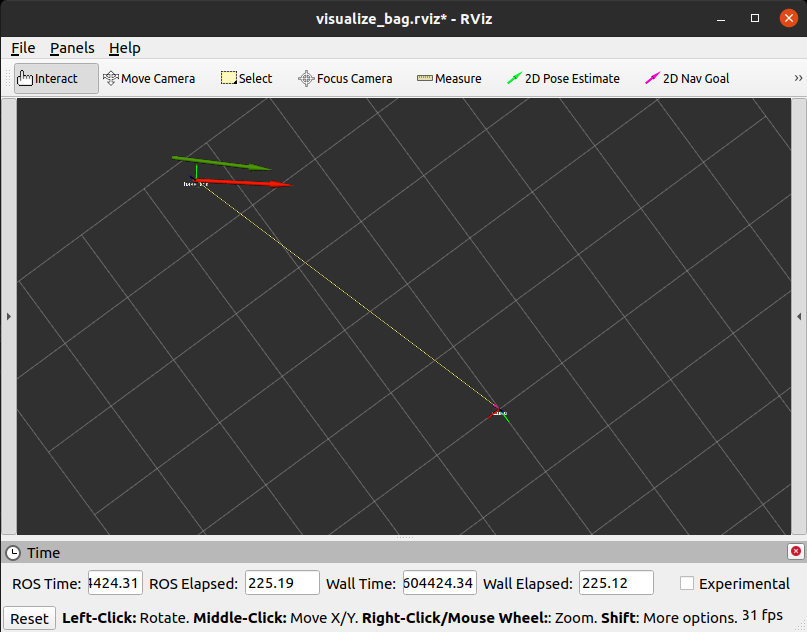

# Skid Steering Odometry
The C++ ROS code is used to compute the odometry of skid steering mobile robot.

## Contents
- Skid Steering Odometry
  - [1. Introduction](#1-introduction)
  - [2. Working](#2-working)
  - [3. Setup](#3-setup)
  - [4. Run](#4-run)
    - [i. Setup parameters](#i-setup-parameters)
    - [ii. Visualize Rosbag](#ii-visualize-rosbag)
    - [iii. Run Skid Steering](#iii-run-skid-steering)
  - [5. Output](#5-output)

## 1. Introduction
This repo contains the C++ code to compute the odometry of a skid steering robot and visualize it on RViz. The code is implemented on ROS so it requires ROS installation on computer to run it. The code is based on paper and ppt present in this [docs folder](https://github.com/dennyboby/skid_steering_odometry/tree/master/docs/document). 

## 2. Working
The skid_steering.cpp subcribes to four wheel velocity topic published by the rosbag present in [data folder](https://github.com/dennyboby/skid_steering_odometry/tree/master/skid_steering/data). These velocity messages are filtered so that the velocities used are approximately syncronous in time. The [skid steering parameters](https://github.com/dennyboby/skid_steering_odometry/tree/master/skid_steering/config/skid_param.yaml) are loaded into parameter server so that skid_steering.cpp can use them to set odometery params and other params. The odometry.cpp uses either euler integration or runge-kutta integration to compute the pose of the robot. This pose is published by the skid_steering.cpp via /odom topic and tf. A custom message containing odometry and integration method is also published on /custom_odom topic. Dynamic reconfigure can be used to change the integration method at runtime. Also two services(/reset_odom and /set_odom_pose) are available to reset the odometry to (0,0,0) and set the odometry to a specific pose. The odometry published by skid_steering.cpp is visualized on RViz and compared with manufacturers odometry(/scout_odom topic) published by the rosbag.

#### RQT Graph

#### TF Tree

## 3. Setup
The setup requires ROS and cakin build to be setup before you proceed. Follow the instruction below in a new terminal.

    mkdir -p ~/skid_steering_ws/src
    cd ~/skid_steering_ws/src
    git clone https://github.com/dennyboby/skid_steering_odometry.git
    cd ..
    catkin init
    catkin build

Source each new terminal by running the following command below.

    source ~/skid_steering_ws/devel/setup.bash

## 4. Run
This section discusses the setup of parameters and running different launch files.

### i. Setup parameters
The parameters that needs to configured can be found in the [skid_param.yaml](https://github.com/dennyboby/skid_steering_odometry/tree/master/skid_steering/config/skid_param.yaml)

### ii. Visualize Rosbag
Rosbags present in the [data folder](https://github.com/dennyboby/skid_steering_odometry/tree/master/skid_steering/data) can be visualized by running the commands below in a new terminal.

    source ~/skid_steering_ws/devel/setup.bash
    roslaunch skid_steering visualize_bag.launch

The above command runs bag1 as default. If you want to run a specific bag follow the command below.

    roslaunch skid_steering visualize_bag.launch bag_file_name:=<name of the bag>

Params available for visualize_bag.launch
| Parameter Name | Description                 | Default Value | Options          |
|----------------|-----------------------------|---------------|------------------|
| bag_file_name  | Name of the bag file to run | bag1          | bag1, bag2, bag3 |

### iii. Run Skid Steering
You can run the skid_steering code and rosbag together by running the commands below. Also the outputs can be visualized in RViz.

    source ~/skid_steering_ws/devel/setup.bash
    roslaunch skid_steering skid_steering.launch

The above command runs bag1 as default. If you want to customize the launch to your liking then you can run the following command below.

    roslaunch skid_steering skid_steering.launch bag_file_name:=<name of the bag> run_bag:=<true or false>

Params available for skid_steering.launch
| Parameter Name | Description                        | Default Value | Options          |
|----------------|------------------------------------|---------------|------------------|
| bag_file_name  | Name of the bag file to run        | bag1          | bag1, bag2, bag3 |
| run_bag        | Set false to run rosbag separately | true          | true, false      |

## 5. Output
As you can see in the image below the green arrow shows the manufacturer's odometry(/scout_odom) and the red arrow shows the odometry computed from code(/odom). The tf tree is also visualized.

